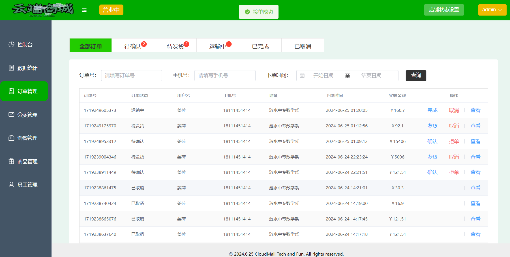
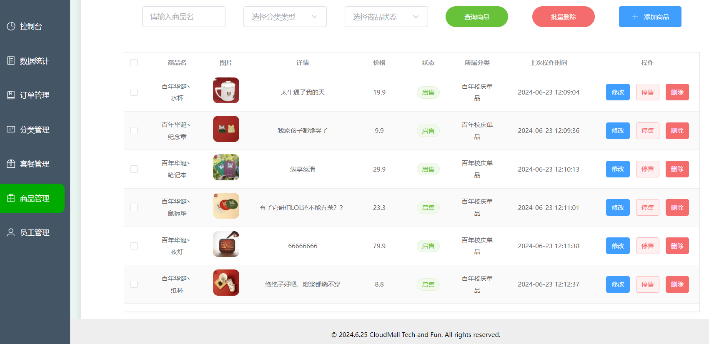
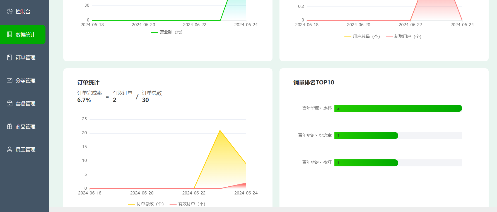
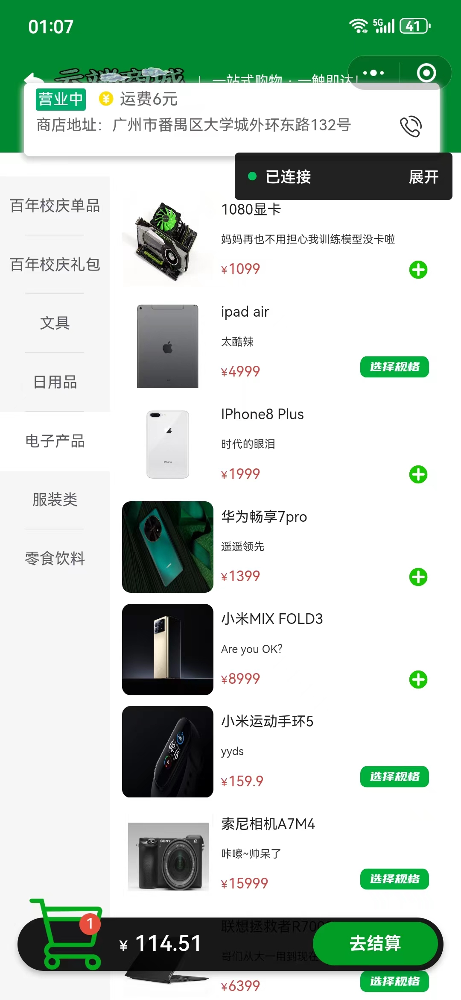
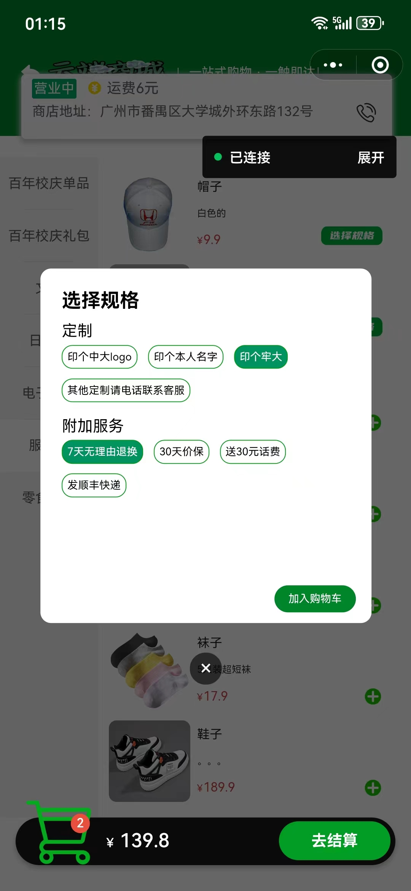
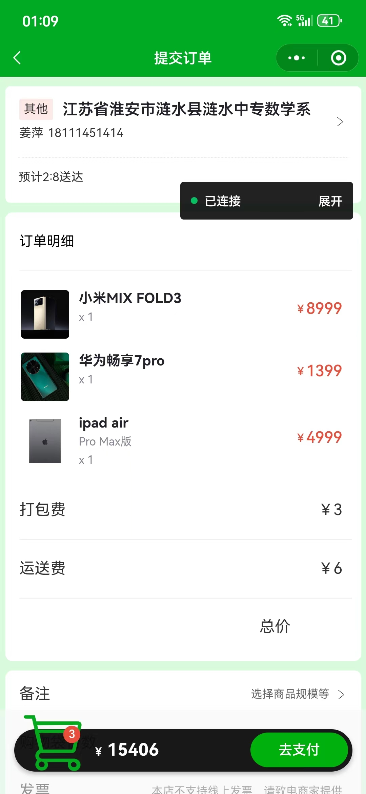
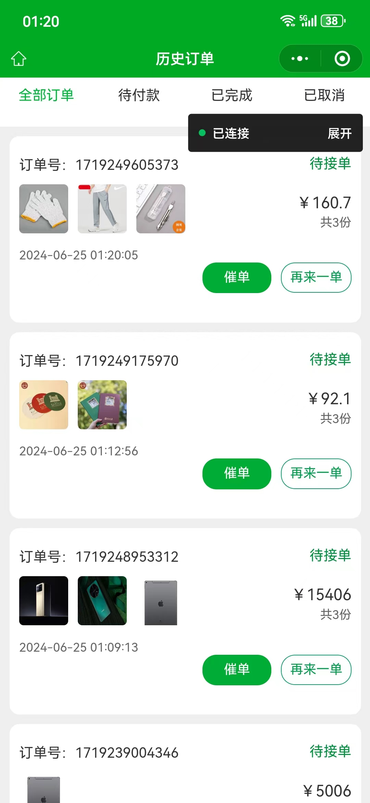
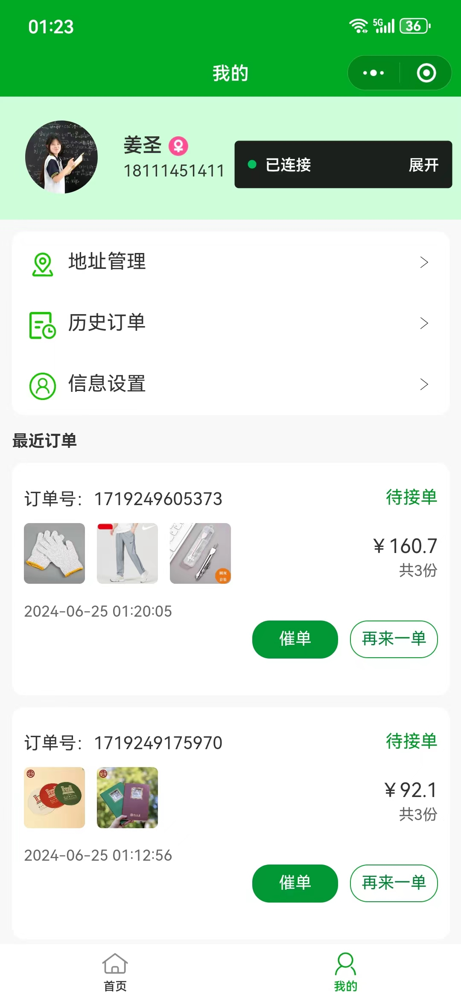

# 云端商城(CloudMall)


~~你说得对，但是~~“云端商城”是一个诞生于 SYSU 软件工程课程的小型电子商务平台，致力于提供全面的在线销售和购物服务。通过集成前沿的前后端框架技术，"云端商城" 旨在创建一个动态、互动和体验优秀的购物环境，满足现代消费者的需求并助力商家扩展业务。

---

主要功能模块：

1. **用户账户管理**：支持用户注册、登录、注销及个人资料管理。
2. **商品展示与管理**：实现商品分类展示、详情页、搜索和筛选。
3. **交互式购物车**：提供便捷的购物车管理和订单流程。
4. **集成化订单处理**：引导用户完成订单确认和支付，提供订单状态跟踪。
5. **多渠道支付系统**：支持多种支付方式，实现支付结果即时验证。
6. **后台管理系统**：为商家提供商品和订单管理，数据统计等后台功能。
7. **数据分析与报告**：提供销售数据和用户行为分析，辅助商家决策。

商家管理端运行截图：

| 登录页 | 商家控制台页 |
| ------------------------------ | ---------------------------------------------- |

| 订单管理 | 商品管理 | 数据统计 |
| - | - | - |

客户小程序运行截图：

|  |  |  |  |  |
| - | - | - | - | - |

## 技术选型

### 前端

- vue3([Node.js](https://nodejs.org/)版本: 20.14.0, 最好不要低于16)
- ts
- uniapp
- pinia
- elementPlus
- ECharts

### 后端

- springboot 3.2.5(需要 JDK 版本 17 以上才能适配)
- mybatis
- [mysql 8.0.37](https://dev.mysql.com/downloads/installer/)
- [redis 5.0.14](https://github.com/tporadowski/redis)
- 使用 maven 3.9.6 构建

## 本地部署步骤

git拉取项目代码

```sh
git clone https://github.com/wi1sonh/cloudmall
cd cloudmall
```

**启动前端：**

```sh
cd cloudmall-vue3
npm i
npm run dev
```

**启动后端：**

首先导入数据库，在mysql命令行输入 `source /path/to/cloudmall_database.sql`即可

在 IDEA 单独打开后端子项目 cloudmall-springboot3，并手动连接数据库（参考网上教程，最好使用**IDEA专业版**，**注意**需要修改 `cloudmall-springboot3\server\src\main\resources\application-dev.yml`第6行为本地mysql设置的密码；若要启动小程序，还需要在底下修改redis密码，以及appid和secret, 且 `cloudmall-uniapp\src\manifest.json`的appid也需要修改）

在 IDEA 右侧边栏的 `Maven -> cloudmall -> Lifecycle -> compile` 编译 root 目录，然后即可运行 `ServerApplication` 主函数

**启动小程序端：**

进入 cloudmall-uniapp 目录执行 `npm i` 进行包安装，接着执行 `npm run dev:mp-weixin`进行编译，之后修改uniapp的内容时，微信开发者工具里编译好的内容也会相应作出修改（有时不会生效，需要重启微信开发者工具才行）

下载[微信开发者工具](https://developers.weixin.qq.com/miniprogram/dev/devtools/stable.html)，申请正式 app id，并使用 secret，导入 `cloudmall-uniapp/dist/mp-weixin` 这部分内容即可

小程序端还需要启动本地 redis 数据库，连接过程和 mysql 差不多（但 redis 连接时不需要输入 username）

## 云服务器部署步骤

详见[云服务器部署文档](doc/云服务器部署文档.md)

## 代码说明

详见[部分代码说明](doc/部分代码说明.md)
