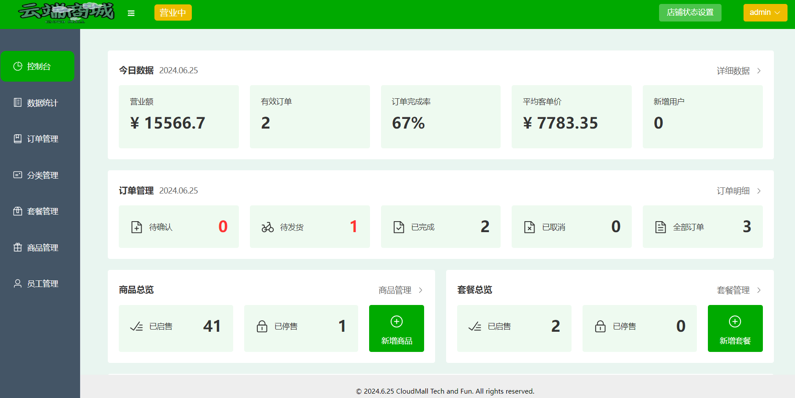

# 云端商城(CloudMall)


"云端商城" 是一个创新驱动的电子商务平台，致力于提供全面的在线销售和购物服务。通过集成前沿技术，包括个性化推荐算法、社交购物功能以及智能客服和聊天机器人，"云端商城" 旨在创建一个动态、互动和智能化的购物环境，满足现代消费者的需求并助力商家扩展业务。

---

主要功能模块：

1. **用户账户管理**：支持用户注册、登录、注销及个人资料管理。
2. **商品展示与管理**：实现商品分类展示、详情页、搜索和筛选。
3. **交互式购物车**：提供便捷的购物车管理和订单流程。
4. **集成化订单处理**：引导用户完成订单确认和支付，提供订单状态跟踪。
5. **多渠道支付系统**：支持多种支付方式，实现支付结果即时验证。
6. **后台管理系统**：为商家提供商品和订单管理，数据统计等后台功能。
7. **数据分析与报告**：提供销售数据和用户行为分析，辅助商家决策。

运行截图：
|登录页  |商家控制台页  |
| - | - |

## 技术选型

### 前端

- vue3(nodejs版本: 20.11.1, 最好不要低于16)
- ts
- uniapp
- pinia
- elementPlus
- ECharts

### 后端

- springboot 3.2.5(需要 JDK 版本 17 以上才能适配)
- mybatis
- [mysql 8.0.37](https://dev.mysql.com/downloads/installer/)
- redis
- 使用 maven 3.9.6 构建

## 本地部署步骤

git拉取项目代码

```sh
git clone https://github.com/wi1sonh/cloudmall
cd cloudmall
```

**启动前端：**

```sh
cd cloudmall-vue3
npm i
npm run dev
```

导入数据库，在mysql命令行输入`source /path/to/cloudmall_database.sql`即可

**启动后端：**

在 IDEA 单独打开后端子项目 cloudmall-springboot3，并手动连接数据库（参考网上教程，最好使用**IDEA专业版**，**注意**需要修改cloudmall-springboot3\server\src\main\resources\application-dev.yml第6行为本地mysql设置的密码；若要启动小程序，还需要在底下修改redis密码，以及appid和secret, 且cloudmall-uniapp\src\manifest.json的appid也需要修改）

Maven编译root目录，然后即可运行ServerApplication主函数

**启动小程序端：**

进入 cloudmall-uniapp 目录执行 npm i 进行包安装，接着执行npm run dev:mp-weixin进行编译，之后修改uniapp的内容时，微信开发者工具里编译好的内容也会相应作出修改（有时不会生效，需要重启微信开发者工具才行）

下载[微信开发者工具](https://developers.weixin.qq.com/miniprogram/dev/devtools/stable.html)，获取测试号，导入`cloudmall-uniapp/dist/mp-weixin` 这部分内容即可

小程序端还需要启动本地redis数据库，连接过程和mysql差不多（但redis连接时不需要输入username）

## 前端代码说明

### vue3网页代码结构

```
├── .vscode              编辑器配置文件
├── node_modules         相关包
├── public
│   └── logo.ico:        页签图标
├── src
│   ├── api:             请求接口
│   ├── assets:          存放静态资源
│   ├── components:      存放普通组件
│   ├── store:           pinia持久化存储
│   ├── types:           ts类型校验，相关类型定义
│   ├── utils:           工具，如request.ts
│   ├── views:           存放页面组件
│   │   ├── layout:      布局文件
│   │   ├── page1:       分页面1
│   │   │   ├── components: 分页面组件
│   │   │   │   └── component1: 分页面组件1
│   │   │   └── index.vue: 分页面
│   │   └── ... :        其他分页面
│   ├── App.vue:         汇总所有组件（一般里面放layout就行）
│   ├── main.ts:         入口文件，注册elementPlus、pinia等等
│   └── router.ts:       路由
├── .eslintrc.rjs:       语法检查配置
├── .gitignore:          git版本管制忽略的配置
├── .prettierrc.json:    代码格式化相关配置
├── env.d.ts:            开发环境的配置
├── index.html:          主页面
├── package.json:        应用包配置文件
├── package-lock.json：  包版本控制文件
├── README.md:           应用描述文件
├── tsconfig.xxx.json:   ts的相关配置文件
├── vite.config.ts:      vite配置文件，可在里面配置代理 5173->8080
└── vitest.config.ts:    vitest配置文件
```

### uniapp小程序代码结构

```
├── .husky                管理git钩子
├── dist                  打包编译好的微信小程序项目
├── node_modules          相关包
├── src
│   ├── api:              请求接口
│   ├── components:       存放普通组件
│   ├── pages:            存放页面组件
│   │   ├── layout:       布局文件
│   │   ├── page1:        分页面1
│   │   │   ├── components: 分页面组件
│   │   │   │   └── component1: 分页面组件1
│   │   │   └── index.vue: 分页面
│   │   ├── index:        tab1 首页
│   │   ├── my:           tab2 个人中心页
│   │   ├── order:        点餐页（左侧分类，右侧菜品列表）
│   │   ├── submit:       准备支付页（选择地址、购物袋，展示订单信息那一页）
│   │   └── ... :         其他分页面
│   ├── static:           存放静态资源
│   ├── stores:           pinia持久化存储
│   ├── types:            ts类型校验，相关类型定义
│   ├── utils:            工具，如http.ts
│   ├── App.vue:          汇总所有组件（一般里面放layout就行）
│   ├── env.d.ts:         开发环境的配置
│   ├── main.ts:          入口文件，注册pinia等等
│   ├── manifest.json:    编译打包配置
│   ├── pages.json:       tab页和普通页面注册，类似网页端的路由router.ts
│   ├── shims-uni.d.ts:   为了 ts 做的适配定义文件，使 ts 能理解 vue
│   └── uni.scss:         uniapp相关内置样式
├── .eslintrc.rjs:        语法检查配置
├── .gitignore:           git版本管制忽略的配置
├── index.html:           主页面
├── package-lock.json:    包版本控制文件
├── package.json:         应用包配置文件
├── shims-uni.d.ts:       为了 ts 做的适配定义文件，使 ts 能理解 vue
├── tsconfig.json:        ts的相关配置文件
└── vite.config.ts:       vite配置文件
```

### 相关代码注意点

#### reactive响应式监听

如果是监听整个 reactive 对象类型的属性，只有进行整个对象替换时，才不需要开启deep深度监听

其它时候，如修改、删除、新增，都需要开启deep深度监听，才能监听数据的变化

如果是监听对象类型属性中的某个属性值，则不需要开启deep深度监听

## 后端代码说明

### Jakarta

springboot3 中的某些部分需要用jakarta, 不用javax，如：

```
拦截器、websocket长连接
```

关于servlet的api接口，本身为JavaEE所有，但是SpringBoot3之后换成 Jakarta EE 了
原因是 eclipse 拿到 Oracle 转过来的 Java EE 规范之后，因版权问题不能使用 javax 名称，所以需要重命名

### 管理端员工权限修改

设置超级管理员和普通员工

如果是超级管理员（本项目用的是admin账号），则有权限进行所有员工的修改和启用禁用操作

如果是普通员工，则只能对自己账号信息进行修改，前端展示时，其他部分的按钮都是禁用状态

### 地址簿功能修改

在修改地址功能调试时，发现前端的省市区数据一直不更新，后来发现是黑马给的update代码并没有这部分数据，所以需要补上

```java
<if test="provinceCode != null">
    province_code = #{provinceCode},
</if>
<if test="provinceName != null">
    province_name = #{provinceName},
</if>
<if test="cityCode != null">
    city_code = #{cityCode},
</if>
<if test="cityName != null">
    city_name = #{cityName},
</if>
<if test="districtCode != null">
    district_code = #{districtCode},
</if>
<if test="districtName != null">
    district_name = #{districtName},
</if>
```

由于校验地址是否超出范围这部分功能需要用到百度地图的服务，并且我弄了很久还是地址解析失败，考虑到这部分功能对后续无影响，因此我先将这部分功能代码注释掉了

### 订单支付功能修改

若有订单待支付时，不能继续下其他单，否则后端把新的用户下单orderid赋给全局变量order，造成后续支付订单时发生错乱

而且如果可以下其他单的话，小程序需要同时开启多个定时器去进行统计，由于我用一个定时器进行各种校验判断已经够繁琐了，折腾了半天，因此我就不考虑这种并发定时器事务的处理了，若用户要下其他单，则进行提示"您有订单未支付，请先处理再来下单"

### 其他琐碎部分记录

websocket没有3.2.5版本，网上也找不到相关教程，只好下回2.7.3的
